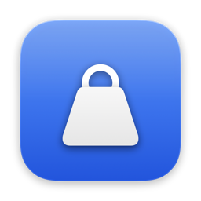
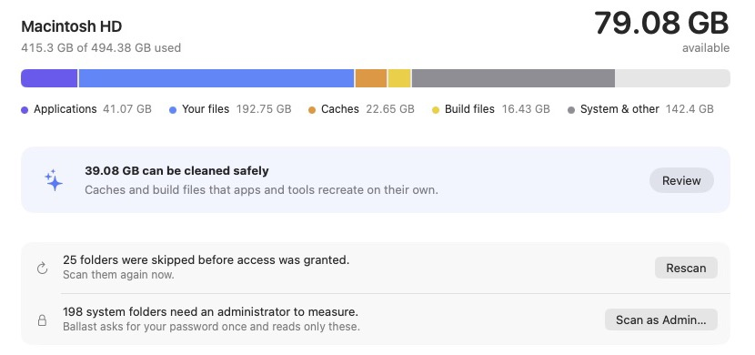

<div align="center">



# Ballast

**See where your Mac's disk space went, and get it back without breaking anything.**

A native macOS app that maps every folder on your disk once, keeps that map current from the macOS change log, and turns what it finds into a short list you can clean safely.

[](https://github.com/reloadlife/ballast/actions/workflows/ci.yml)
[](LICENSE)


<picture>
  <source media="(prefers-color-scheme: dark)" srcset="docs/overview-dark.png">
  
</picture>

</div>

---

## Why Ballast

Your disk is full, a build just failed, and "System Data" says 140 GB. Ballast answers three questions, in order:

1. **Where did the space go?** A storage bar in plain categories, the largest folders on the disk, and a map you can click into.
2. **What can go safely?** Caches, `node_modules`, build output, package-manager downloads, and big folders nobody has touched in six months.
3. **Will anything break?** Every item gets a verdict with a reason, checked again at the moment it's deleted.

It's built for everyone who runs out of space, and especially for developers, whose disks fill with things that are safe to throw away but hard to find.

## Features

- **Whole-disk index.** Every folder on the data volume gets measured, not sampled. On a 500 GB Mac with about 4 million files, the first scan takes around two minutes.
- **Instant updates.** Ballast replays the FSEvents log macOS already keeps and rechecks only the folders that changed, so reopening it takes seconds.
- **Suggestions.** Tool caches (npm, Bun, Go, Cargo, Gradle, uv…), Xcode DerivedData, project build output, Trash, and stale folders, sorted by size.
- **Build folders by type.** `node_modules`, `.next`, Rust and Maven `target`, Gradle `build`, Python venvs and `__pycache__`, `Pods`, `.turbo`, `.svelte-kit`, `.terraform` and more, grouped with totals. Each one is confirmed by its project file (`target/` only counts next to a `Cargo.toml`), never by name alone.
- **Auto-clean rules.** For example: "delete `.next` folders once their project hasn't changed for 3 days". Rules run daily in the background, even with the app closed, and notify you when they clean something. Each rule chooses Trash or Delete; every rule starts off.
- **Explorer.** A treemap plus a sortable table. Drill into any folder and see its size, share and last change at a glance.
- **Cleanup List.** Collect items from anywhere: the ⊕ buttons, drag and drop from Finder, or a file picker. Review them, then clean in one go.
- **Move to Trash by default.** Deleting permanently is a separate, clearly marked choice. Tools with their own cleanup command (`npm cache clean`, `go clean -modcache`, `brew cleanup`) run that command instead of deleting files.
- **What is "System Data"?** One click breaks it down: macOS itself, boot and update files, swap, Recovery, snapshots, downloaded macOS assets, system caches and logs, Homebrew, and anything Ballast couldn't measure. Each part comes with a plain explanation and what, if anything, you can do about it.
- **Honest numbers.** What Ballast can't see (locked folders, file-system overhead) is named, not hidden, and every screen shows the same figures.
- **Native.** SwiftUI on macOS 26, with system materials, SF Symbols, keyboard shortcuts, Dark Mode and Reduce Motion. It uses no network at all.

## Never breaks anything

Before anything is deleted, Ballast gives it one of four verdicts:

| | Verdict | Examples | What happens |
|---|---|---|---|
| ✅ | **Safe** | App caches, `node_modules`, DerivedData, your own files | Cleaned |
| ⏸ | **Quit the app first** | Chrome's cache while Chrome is open | Waits, with a **Quit** button; turns safe once the app closes |
| ⚠️ | **Check first** | Git repositories, tool folders like `~/.bun/bin`, apps | Only cleaned if you tick **Clean this anyway** |
| ⛔ | **Protected** | An installed app's data (browser profiles, logins), Keychains, Preferences, Mail, the Photos library, `.ssh`, `.git`, your top-level folders | Can't be added; the reason is shown |

When Ballast empties `~/Library/Caches`, it **skips the caches of apps that are running** instead of pulling files out from under them. Folders whose owner it can't identify stay protected: a guess isn't good enough when the cost is someone's data. The rules live in [`Safety.swift`](Sources/Ballast/Engine/Safety.swift) and are covered by tests.

## Install

Grab `Ballast.zip` from the [latest release](https://github.com/reloadlife/ballast/releases/latest), unzip it and move **Ballast** to Applications. Release builds are signed ad-hoc, not notarized. The first time you open it, macOS blocks it: go to System Settings › Privacy & Security and click **Open Anyway**. Or clear the quarantine flag yourself:

```sh
xattr -dr com.apple.quarantine /Applications/Ballast.app
```

Or build it yourself (needs Xcode 26 or a Swift 6.2 toolchain on macOS 26):

```sh
git clone https://github.com/reloadlife/ballast.git
cd ballast
./scripts/bundle.sh        # builds Ballast.app
open Ballast.app
```

### Permissions

- **Full Disk Access** (recommended): macOS hides Photos, Mail, iOS backups and some app data from every app, root included. Grant it in System Settings › Privacy & Security › Full Disk Access, then reopen Ballast.
- **Administrator** (optional): a handful of system folders such as `/private/var` need an admin to measure. Ballast asks for your password once and reads only those folders.

To keep the Full Disk Access grant across rebuilds, sign with your own identity: put `SIGN_ID=<your identity>` in `scripts/signing.local`. That file is gitignored.

## How it works

```
first launch  ─▶  fts walk of /System/Volumes/Data  ─▶  SQLite index of every folder
                  (one pass, like du -x)                  (sizes include everything below)

every launch  ─▶  replay FSEvents since last time   ─▶  recheck only changed folders
                  (the log macOS keeps anyway)            and adjust their parents' totals
```

- It walks `/System/Volumes/Data`, not `/`, so firmlinked folders like `/Users` and `/Applications` count once.
- It stores folders only; files are folded into their parent's size. A 500 GB disk makes an index of about 600k rows.
- Hard links are counted once, and sizes are what's actually allocated on disk (what `du` reports), not logical file sizes.
- If the change log can't be trusted (events dropped, IDs wrapped, too many changes), Ballast falls back to a full scan instead of guessing.

### Command line

The app binary doubles as a CLI, handy for cron jobs or CI boxes:

```sh
Ballast.app/Contents/MacOS/Ballast --index full           # rebuild the index
Ballast.app/Contents/MacOS/Ballast --index update         # replay changes since last run
Ballast.app/Contents/MacOS/Ballast --auto-clean --dry-run # what your rules would clean now
```

Auto-clean rules live in `~/Library/Application Support/Ballast/autoclean.json`. The background run is a LaunchAgent (`dev.mamad.Ballast.autoclean`), installed and removed from Settings, and logs to `~/Library/Logs/Ballast/autoclean.log`.

## Project layout

```
Sources/Ballast/
├── Engine/        Walker (fts), IndexDB (SQLite), ScanEngine (full + incremental),
│                  ChangeLog (FSEvents), Safety, Cleaner, AdminScan, History,
│                  ArtifactKind (build folders), AutoClean, SystemData
├── Views/         Overview, Explorer, Suggestions, Cleanup List, treemap
├── Catalog.swift  Known caches and tools, and what counts as build output
└── AppModel.swift State, caching, and the scan/clean flows
Tests/BallastTests Safety rules, treemap layout, walker, cleaner
```

## Contributing

Issues and pull requests are welcome. A good first contribution is teaching [`ArtifactKind`](Sources/Ballast/Engine/ArtifactKind.swift) another kind of build folder: a name plus the marker file that proves it. Please add a test for anything that touches the safety rules.

```sh
swift build && swift test
```

### Releasing

Push a tag like `v0.2.0` and the [release workflow](.github/workflows/release.yml) tests, builds and publishes `Ballast.zip`. It signs with a Developer ID and notarizes automatically when these repository secrets are set: `MACOS_CERTIFICATE_P12` (base64 `.p12`), `MACOS_CERTIFICATE_PASSWORD`, `NOTARY_KEY_P8` (base64 App Store Connect API key), `NOTARY_KEY_ID` and `NOTARY_ISSUER_ID`. Without them, releases are signed ad-hoc.

## License

[GNU AGPL v3](LICENSE) © Mohammad Mahdi Afshar
