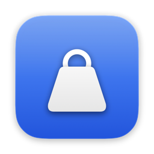
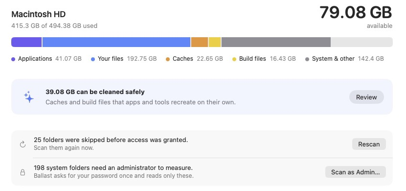

<div align="center">



# Ballast

**See where your Mac's disk space went, and get it back without breaking anything.**

A native macOS app that maps every folder on your disk once, keeps that map current from the macOS change log, and turns what it finds into a short list you can clean safely.

[](https://github.com/reloadlife/ballast/actions/workflows/ci.yml)
[](LICENSE)


<picture>
  <source media="(prefers-color-scheme: dark)" srcset="docs/overview-dark.png">
  
</picture>

</div>

---

## Why Ballast

Your disk is full, a build just failed, and "System Data" says 140 GB. Ballast answers three questions, in order:

1. **Where did the space go?** A storage bar in plain categories, the largest folders on the disk, and a map you can click into.
2. **What can go safely?** Caches, `node_modules`, build output, package-manager downloads, and big folders nobody has touched in six months (or however long you choose in Settings).
3. **Will anything break?** Every item gets a verdict with a reason, checked again at the moment it's deleted.

It's built for everyone who runs out of space, and especially for developers, whose disks fill with things that are safe to throw away but hard to find.

## Features

- **Whole-disk index.** Every folder on the data volume gets measured, not sampled. On a 500 GB Mac with about 4 million files, the first scan takes around two minutes.
- **Instant updates.** Ballast replays the FSEvents log macOS already keeps and rechecks only the folders that changed, so reopening it takes seconds.
- **Suggestions.** Tool caches (npm, Bun, pnpm, Yarn, pip, CocoaPods, Composer, Deno, Go, Cargo, Gradle, uv…), logs, Xcode DerivedData, device support files and previews, project build output, Trash, and stale folders, sorted by size. Things you'd miss get **Check first**: Xcode archives, the Maven repository, Hugging Face and Ollama models, Android emulators and system images, and `docker system prune` (it keeps volumes, but not what's inside stopped containers).
- **Build folders by type.** `node_modules`, `.next`, Rust and Maven `target`, Gradle `build`, SwiftPM `.build`, .NET `bin`/`obj`, Elixir `_build`/`deps`, Haskell `.stack-work`, Python venvs, `.tox`, `__pycache__` and pytest/mypy/Ruff caches, `Pods`, `Carthage/Build`, `.turbo`, `.nx`, `.svelte-kit`, `.astro`, `.expo`, `.vercel/output`, `.wrangler/tmp`, coverage reports, `.terraform` and more, grouped with totals. Each one is confirmed by the file that proves it (`target/` only counts next to a `Cargo.toml`, `coverage/` only next to a `package.json` and with a report inside), never by name alone.
- **Unused apps.** Apps you haven't opened in six months (the same setting as stale folders), by last-opened date from Spotlight, with what uninstalling frees: "App 420 MB + data 1.2 GB". The data is found by exact identity only: the app's bundle id or name in `~/Library` (Containers, Application Support, Caches, Preferences, Saved Application State, HTTPStorages, WebKit), plus group containers whose own metadata names a group only that app declares. Uninstalling moves the app and that data to the Trash, always, even with Delete Now chosen. Apple's own apps, aliases into the system volume and Ballast itself are never listed; apps with no Spotlight record say so instead of guessing a date.
- **Installers and disk images.** `.dmg`, `.pkg`, `.mpkg` and `.xip` files of 10 MB or more in Downloads, Desktop and Documents (and their direct subfolders), plus `.zip` files with an app at the top. Each shows when it was added and, when the file is named after an app you have, that the app is installed. A mounted disk image gets an **Eject** button and is cleaned only once it's ejected.
- **Put Back.** Every cleanup, auto-clean runs included, is logged with where each item went in the Trash. **Put Back** (on the result, in **Cleanup History**, or Edit › Put Back Last Cleanup) moves them back, and never over something new: "A new node_modules exists there now, so it was left in the Trash." Deleting permanently and tool commands can't be undone, and the Cleanup List says so where you choose.
- **Auto-clean rules.** For example: "delete `.next` folders once their project hasn't changed for 3 days". Rules run daily in the background, even with the app closed, and notify you when they clean something. Each rule chooses Trash or Delete; every rule starts off.
- **Menu bar item.** Free space, the storage bar and what's safe to clean, one click away, with Refresh and Review Cleanup. With it on, closing the window keeps Ballast running there instead of in the Dock.
- **Desktop widget.** Free space, what fills the disk and what's safe to clean, in small, medium and large sizes. The free-space figure is read fresh every time the widget updates; the breakdown comes from Ballast's last scan and says how old it is. Click it to open the Overview, or "safe to clean" to open Suggestions.
- **Shortcuts, Siri and Spotlight.** Six actions: Get Free Space, Get Disk Status, Update Disk Index, Run Auto-Clean (a preview unless you turn Preview Only off), Put Back Last Cleanup and Open Ballast. See [Shortcuts](#shortcuts).
- **Low-space alert.** A notification when free space drops below a threshold you pick (20 GB by default), checked hourly even with the app closed: "Only 12 GB left on Macintosh HD. 8.4 GB is safe to clean."
- **What grew.** "My disk was fine yesterday": the Overview lists the folders that grew since you last opened Ballast, or over the last 24 hours, 7 days or 30 days, with what shrinking folders freed. Each row is the deepest folder that explains the growth, and no byte is counted twice: a parent is listed only for what its listed subfolders don't explain ("~/Library · not counting go-build"). Ballast notes the size of every folder over 20 MB once a day (about 5,000 folders, a few MB for 90 days) in `growth.sqlite`, which a full rescan doesn't touch. It only offers periods it has history for, and the card says the exact date it compares with.
- **Other drives.** External drives, other APFS volumes and disk images you mount show up under **Disks** in the sidebar, with their format, capacity and free space. Ballast scans one only when you ask, keeps a separate index for each (so an unplugged drive stays listed: "Not connected · scanned 3 days ago", with **Forget**), and shows it in Overview and Explorer: build folders, other folders, and space no folder holds, measured the way `du` counts it. APFS and Mac OS Extended drives are updated from their own change log, even after being unplugged; ExFAT and FAT drives start a new log every time they're plugged in, so Ballast rescans them and says so. Build folders on connected drives appear in Suggestions, and cleaning there goes to that drive's own Trash, with Put Back. Read-only drives (NTFS, for one) can be explored but never cleaned; network drives aren't supported yet, and Time Machine backup disks aren't listed at all. The menu bar item, widget and Shortcuts stay about the startup disk.
- **Largest files.** The Overview lists the ten largest files on the disk, with **Show All** for every file of 50 MB or more (about 500 files on a 500 GB Mac), filtered by kind: videos, disk images and archives, VMs and containers, and everything else. Each row has the file's icon, where it is, when it last changed, Quick Look, Show in Finder and ⊕. Files keep the safety rules of where they are: inside the Photos library, Mail, an app's container or `.git` they stay protected, and a VM's disk waits while UTM, Parallels, VMware Fusion, VirtualBox, Docker or OrbStack is open. Files in folders Ballast couldn't read can't be listed, and the list says how many folders that is.
- **Duplicate files.** **Find Duplicates** in Suggestions compares the large files on the startup disk, only when asked, and can be stopped: files of the same size are compared by their first and last 64 KB, and only those still matching are read in full (SHA-256). Hard links aren't copies, and APFS clones already share their storage, so a set of clones is named ("already share storage") but never suggested, and a clone's copy counts only the blocks it doesn't share. Each set keeps one copy (the oldest outside Downloads, the Desktop and the Trash, or the one you pick), and **Add Others** puts the rest on the Cleanup List with what removing each actually frees. Nothing is removed on its own, and copies in protected places aren't compared.
- **Explorer.** A treemap plus a sortable table. Drill into any folder and see its size, share and last change at a glance; the file button adds the folder's files of 50 MB or more to the table and the map. **Search** (⌘F) finds folders by name anywhere on the disk, biggest first, in about 40 ms. Space opens Quick Look, ⌥⌘R shows the selected folder in Finder, and the context menu copies a path or rows as CSV.
- **Export.** File › Export… (⇧⌘E) saves the open folder's list in Explorer, or the largest folders on the Overview, as CSV or JSON: path, name, bytes, size, share, last change, and whether the folder was locked.
- **Cleanup List.** Collect items from anywhere: the ⊕ buttons, drag and drop from Finder, or a file picker. Review them, then clean in one go.
- **Move to Trash by default.** Deleting permanently is a separate, clearly marked choice. Tools with their own cleanup command (`npm cache clean`, `go clean -modcache`, `brew cleanup`, `pod cache clean`) run that command instead of deleting files. A cache listed on its own, like pip's inside `~/Library/Caches`, is left alone when its parent folder is emptied, so nothing is counted twice.
- **What is "System Data"?** One click breaks it down: macOS itself, boot and update files, swap, Recovery, snapshots, downloaded macOS assets, system caches and logs, Homebrew, and anything Ballast couldn't measure. Each part comes with a plain explanation and what, if anything, you can do about it. Time Machine's local snapshots are listed with their dates, and **Delete Local Snapshots…** asks macOS to thin them (backups on your backup disk aren't touched) and shows how much space came back.
- **Honest numbers.** What Ballast can't see (locked folders, file-system overhead) is named, not hidden, and every screen shows the same figures.
- **Native.** SwiftUI on macOS 26, with system materials, SF Symbols, keyboard shortcuts, Dark Mode and Reduce Motion. It only goes online to check for updates, and only if you allow it.

## Never breaks anything

Before anything is deleted, Ballast gives it one of four verdicts:

| | Verdict | Examples | What happens |
|---|---|---|---|
| ✅ | **Safe** | App caches, `node_modules`, DerivedData, downloaded installers, your own files | Cleaned |
| ⏸ | **Quit the app first** | Chrome's cache while Chrome is open; uninstalling an app that's open | Waits, with a **Quit** button; turns safe once the app closes |
| ⚠️ | **Check first** | Git repositories, tool folders like `~/.bun/bin`, apps; uninstalling an app with its data, or one that installs system components ("use its own uninstaller if it has one") | Only cleaned if you tick **Clean this anyway** |
| ⛔ | **Protected** | An installed app's data (browser profiles, logins), Keychains, Preferences, Mail, the Photos library, `.ssh`, `.git`, your top-level folders; apps only an administrator, or macOS App Management, lets Ballast remove | Can't be added; the reason is shown |

An app's data stays protected on its own; it can only go together with its app, as one uninstall that's checked again when it runs (same app, still closed, same data). Ballast never asks for admin rights to delete: a root-owned app is skipped with the reason, not escalated. When Ballast empties `~/Library/Caches`, it **skips the caches of apps that are running** instead of pulling files out from under them. Folders whose owner it can't identify stay protected: a guess isn't good enough when the cost is someone's data. The rules live in [`Safety.swift`](Sources/Ballast/Engine/Safety.swift) and are covered by tests.

## Install

Grab `Ballast.zip` from the [latest release](https://github.com/reloadlife/ballast/releases/latest), unzip it and move **Ballast** to Applications. Release builds are signed ad-hoc, not notarized. The first time you open it, macOS blocks it: go to System Settings › Privacy & Security and click **Open Anyway**. Or clear the quarantine flag yourself:

```sh
xattr -dr com.apple.quarantine /Applications/Ballast.app
```

Ballast updates itself with [Sparkle](https://sparkle-project.org). The second time you open it, it asks whether to check for updates automatically (once a day, from this repository's latest release); until you say yes, it only checks when you choose **Check for Updates…** in the Ballast menu, the menu bar item or Settings › About. Settings › General › Updates changes this later, and can also have updates download and install on their own. Every update is checked against the signing key built into the app before it's installed. Builds without a key (`swift run`, or a checkout with no `Resources/sparkle-public-key.txt`) never check, and Settings says so.

Or build it yourself (needs Xcode 27 on macOS 26 or later; `bundle.sh` uses its App Intents tools for the Shortcuts actions):

```sh
git clone https://github.com/reloadlife/ballast.git
cd ballast
./scripts/bundle.sh        # builds Ballast.app
open Ballast.app
```

### Adding the widget

Open Ballast once so it can measure the disk, then right-click the desktop, choose **Edit Widgets…**, search for **Ballast**, and drag the size you want onto the desktop (or into Notification Center). The widget reads the figures Ballast saves in `~/Library/Application Support/Ballast/status.json` and nothing else; it's sandboxed, with read-only access to that one folder.

### Shortcuts

Ballast's actions show up in the Shortcuts app (search for **Ballast** in the action list), in Spotlight, and to Siri, with no setup. Nothing is added to your shortcuts library; build your own with them, or just say the phrase.

| Action | What it does | Say or type |
|---|---|---|
| **Get Free Space** | Returns free space as a size, and says "86 GB free of 494 GB". The same figure as the Overview and Finder. | "How much space is free in Ballast" |
| **Get Disk Status** | Returns free space, capacity, what's safe to clean and when Ballast last scanned, for use one by one. Free space is read fresh; the rest is from the last scan. | "Ballast disk status" |
| **Update Disk Index** | Brings the index up to date from the macOS change log, or rescans the whole disk when it has to, and reports progress. | "Update Ballast index" |
| **Run Auto-Clean** | Runs your auto-clean rules now. **Preview Only** is on by default: it lists what the rules would clean and removes nothing. Turned off, it asks first, and says so when your rules delete permanently. With no rule on, it says so. | "Preview Ballast auto-clean" |
| **Put Back Last Cleanup** | Asks first, then moves the newest cleanup that still has items in the Trash back where they were, never over something new, and names anything it left in the Trash. | "Undo the last Ballast cleanup" |
| **Open Ballast** | Opens the window on Overview, Explorer or Suggestions. | "Open Suggestions in Ballast" |

The actions run inside Ballast, which macOS starts if it isn't running. They clean nothing your auto-clean rules or the Cleanup List wouldn't, with the same checks. If you keep more than one copy of Ballast (say, a build in the project folder and one in Applications), macOS reads the actions from only one of them, so keep the copy you use up to date.

### Permissions

- **Full Disk Access** (recommended): macOS hides Photos, Mail, iOS backups and some app data from every app, root included. Grant it in System Settings › Privacy & Security › Full Disk Access, then reopen Ballast.
- **Administrator** (optional): a handful of system folders such as `/private/var` need an admin to measure. Ballast asks for your password once and reads only those folders.

To keep the Full Disk Access grant across rebuilds, sign with your own identity: put `SIGN_ID=<your identity>` in `scripts/signing.local`. That file is gitignored.

## How it works

```
first launch  ─▶  fts walk of /System/Volumes/Data  ─▶  SQLite index of every folder
                  (one pass, like du -x)                  (sizes include everything below)

every launch  ─▶  replay FSEvents since last time   ─▶  recheck only changed folders
                  (the log macOS keeps anyway)            and adjust their parents' totals
```

- It walks `/System/Volumes/Data`, not `/`, so firmlinked folders like `/Users` and `/Applications` count once.
- It stores folders, with files folded into their parent's size, plus one row for each file of 50 MB or more (name, allocated and logical size, modification time, inode), kept current by the same updates. A 500 GB disk makes an index of about 450k folder rows and 500 file rows; listing the files adds nothing measurable to a full scan (77–79 s, against 77 s without) and about 70 KB to a 36 MB index.
- An index from before large files were listed keeps working: the next update adds the (empty) table, and the Overview says "Largest files appear after the next full scan" until a full scan has filled it, rather than showing only the folders that changed since.
- Hard links are counted once, and sizes are what's actually allocated on disk (what `du` reports), not logical file sizes.
- If the change log can't be trusted (events dropped, IDs wrapped, too many changes), Ballast falls back to a full scan instead of guessing.
- Other drives get their own index, `volumes/<volume UUID>/index.sqlite`, next to the startup disk's (which stays at `index.sqlite`, where the command line and widget read it). They're walked from their mount point and never scanned on their own. An APFS or Mac OS Extended drive keeps its FSEvents history on the drive itself, so Update replays it with a device-relative stream, as long as the history's ID still matches the one saved with the index; ExFAT and FAT drives get a new history on every mount, so they're rescanned. A drive that comes back under another name ("Drive 1") keeps its index. Ejecting a drive mid-scan stops the scan so the eject goes through, and a scan whose drive vanished is thrown away before it's saved: the last complete index stays.

### Command line

The app binary doubles as a CLI, handy for cron jobs or CI boxes:

```sh
Ballast.app/Contents/MacOS/Ballast --index full           # rebuild the index
Ballast.app/Contents/MacOS/Ballast --index update         # replay changes since last run
Ballast.app/Contents/MacOS/Ballast --auto-clean --dry-run # what your rules would clean now
Ballast.app/Contents/MacOS/Ballast --check-space          # low-space alert check (no scan)
```

Auto-clean rules live in `~/Library/Application Support/Ballast/autoclean.json`; daily folder sizes for "what grew" in `growth.sqlite` (`--index` runs add today's too); the last 20 cleanups, with where their items went in the Trash, in `trash-log.json`; excluded and protected folders, and the other Settings the command line also needs, in `settings.json` next to it. The background runs are LaunchAgents that Ballast installs and removes to match Settings: `dev.mamad.Ballast.autoclean` daily while background auto-clean is on, and `dev.mamad.Ballast.spacecheck` hourly while the low-space alert is on. They log to `~/Library/Logs/Ballast/`. Every run, and the app, keeps a summary of the Overview's figures in `status.json` and asks the widget to redraw from it.

## Project layout

```
Sources/Ballast/
├── Engine/        Walker (fts), IndexDB (SQLite), ScanEngine (full + incremental),
│                  ChangeLog (FSEvents), Safety, Cleaner, AdminScan, History,
│                  ArtifactKind (build folders), AutoClean, SystemData,
│                  LowSpace, StatusSnapshot+Index (writes status.json),
│                  Apps (unused apps and their data), Installers,
│                  TrashLog (cleanup log and Put Back),
│                  Growth (daily folder sizes and "what grew"),
                  LargeFiles (files of 50 MB or more, by kind),
                  Duplicates (content hashing, APFS clone detection),
│                  Volumes (other drives: listing, per-drive indexes,
│                  drive facts for the safety rules)
├── Intents/       Shortcuts, Siri and Spotlight actions (App Intents) and
│                  what they say
├── Views/         Overview, Explorer, Suggestions, Cleanup List, Cleanup
│                  History, treemap, menu bar item, Settings
├── Catalog.swift  Known caches and tools, and what counts as build output
├── Updates.swift  In-app updates (Sparkle), and whether this build can have them
└── AppModel.swift State, caching, and the scan/clean flows
Sources/BallastCore  What the app and the widget share: StatusSnapshot
                     (status.json), free space, category colors
Sources/BallastWidget The WidgetKit extension, bundled as
                     Ballast.app/Contents/PlugIns/BallastWidget.appex
Sources/WidgetRender Development only: draws the widget to PNGs
                     (`swift run WidgetRender <folder>`), never bundled
Tests/BallastTests   Safety rules, treemap layout, walker, cleaner,
                     large files and duplicates (clones, hard links),
                     growth ranking, search escaping, CSV export,
                     Shortcuts action wording, drive listing and
                     per-drive indexes
```

## Contributing

Issues and pull requests are welcome. A good first contribution is teaching [`ArtifactKind`](Sources/Ballast/Engine/ArtifactKind.swift) another kind of build folder: a name plus the marker file that proves it. The marker can sit beside the folder (`Cargo.toml`, any `*.csproj`), inside it (`pyvenv.cfg`, `CACHEDIR.TAG`, `lcov.info`), or, for a folder inside another one like `Carthage/Build`, in the project two levels up. Add a case to the table in `AutoCleanTests.swift`, which checks every kind with and without its marker. Please add a test for anything that touches the safety rules.

```sh
swift build && swift test
```

### Releasing

Push a tag like `v0.2.0` and the [release workflow](.github/workflows/release.yml) tests, builds and publishes `Ballast.zip`. It signs with a Developer ID and notarizes automatically when these repository secrets are set: `MACOS_CERTIFICATE_P12` (base64 `.p12`), `MACOS_CERTIFICATE_PASSWORD`, `NOTARY_KEY_P8` (base64 App Store Connect API key), `NOTARY_KEY_ID` and `NOTARY_ISSUER_ID`. Without them, releases are signed ad-hoc.

In-app updates need one more secret, `SPARKLE_ED_PRIVATE_KEY`, and the matching public key in the repository. Set both up once, on your Mac:

```sh
./scripts/sparkle-setup.sh          # creates the key in your login keychain,
                                    # writes Resources/sparkle-public-key.txt
.build/artifacts/sparkle/Sparkle/bin/generate_keys -x private.key
gh secret set SPARKLE_ED_PRIVATE_KEY < private.key
rm private.key
git add Resources/sparkle-public-key.txt && git commit -m "Add Sparkle public key"
```

From then on, `bundle.sh` builds the public key into the app, and each release also publishes `appcast.xml`, signed with the private key, next to `Ballast.zip`. The app reads it from `releases/latest/download/appcast.xml`, so it always sees the newest release. Keep the key in your keychain and a backup: updates signed with any other key won't install over existing copies. Sparkle compares build numbers (`CFBundleVersion`, the workflow's run number), so every release is newer than the last. Without the secret, releases skip the appcast and nothing else changes.

## License

[GNU AGPL v3](LICENSE) © Mohammad Mahdi Afshar
